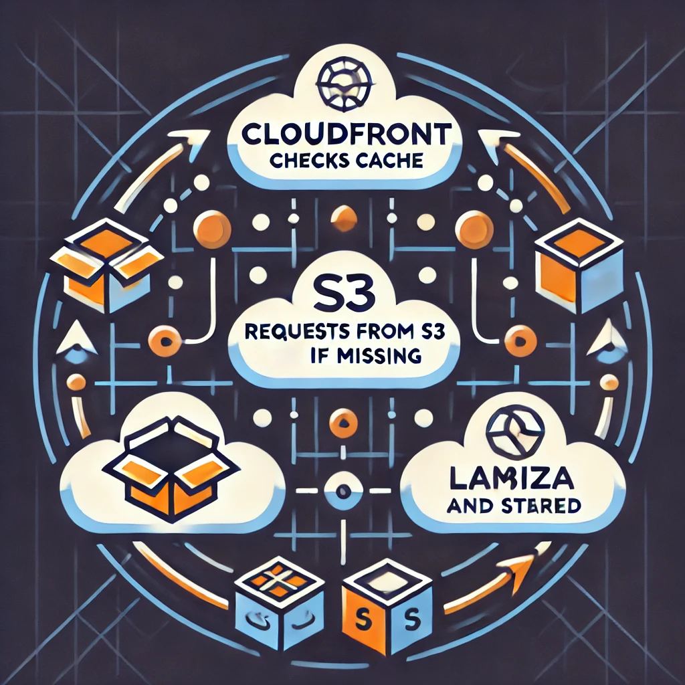

# Lambda Function for Image Resizing and Document Handling

## Overview

This Lambda function processes image resizing and document handling requests integrated with an AWS CloudFront distribution. It dynamically resizes images, generates document previews, and performs on-the-fly document conversions.

---

## Workflow Summary

1. **Request Handling**:
   - Requests for images or documents are routed through AWS CloudFront.
   - CloudFront forwards dynamic requests to the Lambda function.

2. **Processing**:
   - **Image Requests**:
     - Extracts parameters (e.g., dimensions, quality) from the URL.
     - Resizes the image using [Sharp](https://sharp.pixelplumbing.com/).
     - Stores the processed image in S3.
   - **Document Requests**:
     - Checks if the requested document/preview exists in S3.
     - If not, generates the document (e.g., PDF/DOCX) using external APIs.
     - Stores the generated document or preview in S3.

3. **Response**:
   - CloudFront caches the processed files for subsequent requests.
   - Lambda directly returns the processed files if not cached.

---

## Key Components

1. **AWS Lambda**:
   - Executes the resizing and document generation logic using Node.js.
   - Accesses S3 for storing and retrieving files.

2. **AWS S3**:
   - Stores original and processed images/documents.

3. **AWS CloudFront**:
   - Routes requests to S3 or Lambda based on the URL structure.
   - Caches processed files for faster delivery.

4. **AWS SSM**:
   - Manages secrets (e.g., API keys for document generation).

---

## Example Endpoints

1. **Image Resizing**:
   - **URL**: `https://cdn.example.com/images/300x300/sample.webp`
   - **Output**: Resized WebP image.

2. **Document Generation**:
   - **URL**: `https://cdn.example.com/documents/12345/sample.pdf`
   - **Output**: Generated or retrieved document (PDF/DOCX).

---

## Architecture Diagram

Below is a diagram illustrating the system architecture:

---
